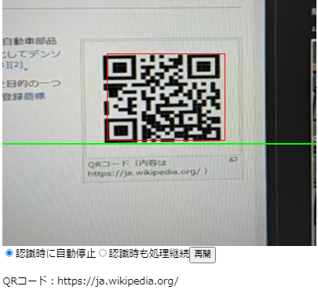

# create-react-app(TypeScript)で作成したアプリにWeb Workerを導入する方法


* [github pages - 動作確認ページ](https://murasuke.github.io/qr-reader-react-webworker/)

* [github - QRコード認識Reactコンポーネント with Web Worker](https://github.com/murasuke/qr-reader-react-webworker/)


## はじめに

以前作成した[QRコード認識Reactコンポーネント](https://github.com/murasuke/qr-reader-react)を格好よくするため、上下に移動する「緑色のバー」を追加しました(CSS animation)。

※ ↓ 画像なのでわかりづらいですが「緑色のバー」が上下します。




ところが、バーの動きが**ガクガク**になり、スムーズにアニメーションしてくれません。
QRコードの認識処理が描画処理がブロックしているようです。(タイマーで定期的に実行しているため）

こういう場合は[Web Worker](https://developer.mozilla.org/ja/docs/Web/API/Web_Workers_API/Using_web_workers)をを利用すれば、バックグラウンドで認識処理行うことができます。
ところが簡単には導入できないようです。

* create-react-appがWeb Workerをサポートしていない

* TypeScriptをWeb Workerで動作させるにはejectする必要がある

試行錯誤の上、ejectしなくても動く手段が見つかりましたので顛末をまとめます。

---

## [comlink-loader](https://github.com/GoogleChromeLabs/comlink-loader)を使うと、容易に導入できます

Web Workerで実行する処理をTypeScriptの`通常のメソッドとして`書くことができます。
呼び出しも通常の非同期メソッド(postMessageは不要)として呼びだすことができる優れものです。


**Web Workerを意識せず、メソッドの呼び出しとして処理できてしまいます！**

* QRコード認識については[QRコード認識Reactコンポーネント](https://github.com/murasuke/qr-reader-react)をご確認ください。
---

### [comlink-loader](https://github.com/GoogleChromeLabs/comlink-loader)の組み込み手順

* ./src/worker フォルダに下記3ファイルを作成します

| ファイル名 | 説明 | 
|-----------|------------|
|custom.d.ts|型定義。worker.tsの型に合わせる(戻り値はPromis<>でラップする)|
|index.ts|workerのインラインローダー。説明を読んでもよくわかりません・・・・|
|worker.ts|Web Workerに実行させる処理(function)定義|

```typescript
/* ./worker/custom.d.ts */
declare module 'comlink-loader!*' {
  class WebpackWorker extends Worker {
    constructor();

    // Add any custom functions to this class.
    // Make note that the return type needs to be wrapped in a promise.
    processData(data: ImageData): Promise<QRCode>;
  }

  export = WebpackWorker;
}
```

```typescript
/* ./worker/index.ts */
// eslint-disable-next-line
import Worker from 'comlink-loader!./worker'; // inline loader

export default Worker;
```

* QRコードの認識処理を記載します。

```typescript
/* ./worker/worker.ts */
import jsqr, { QRCode } from 'jsqr';

export function processData(data: ImageData): QRCode {
  // Process the data without stalling the UI
  const qr = jsqr(data.data, data.width, data.height);
  if (qr) {
    console.log(qr.data);
    return qr;
  }
  return null;
}
```

* 利用側ソース

Workerを生成して、Promiseを返す非同期メソッドとして呼び出すだけです。
(workerはレンダリング毎に生成されるのを防ぐためuseMemo()でキャッシュしています)

> PostMessage()を使わず、普通のメソッドとしてWeb Workerが呼び出せてしまいます。

```typescript
/* ./QRReader.tsx */
const QRReader: React.FC<QRReaderProps> = (props) => {
  const worker = useMemo(() =>  new Worker(), [])

  // ～～～ 途 中 略 ～～～

  timerId.current = setInterval(() => {
    context.drawImage(video.current, 0, 0, width, height);
    const imageData = context.getImageData(0, 0, width, height);
    worker.processData(imageData).then(qr => {
    if (qr) {
      console.log(qr.data);
      if (props.showQRFrame) {
        drawRect(qr.location.topLeftCorner, qr.location.bottomRightCorner);
      }
      if (props.gecognizeCallback) props.gecognizeCallback(qr);               
    }
    });
  }, props.timerInterval);
```


## create-react-appで作ったアプリケーションとWeb Workerを組み合わせた場合に発生する技術的な課題について

[Create React AppでWeb Workerを使うには](https://blog.makotoishida.com/2018/11/create-react-appweb-worker.html) からの引用です。Web Workerを使うのはかなりしんどいようです。

### 1. publicフォルダにWorkerのJSファイルを配置して読み込む

Web Workerは`.js`ファイルを読み込むため、publicフォルダに`worker.js`ファイルを別途作成して配置しておくか、`worker.ts`を別途tscでビルドしてpublicフォルダに配置するようにする必要がある。

```javascript
const worker = new Worker('worker.js');
worker.postMessage(`hoge`);
```

> 処理内容をTypeScriptで書きたい、別にビルドするのが面倒なので却下

### 2. ejectしてからWebPackの設定に worker-loader または worker-plugin を追加する

> ejectしたくない、WebPackを直接使いたくない却下

### 3. ejectせずに react-app-rewired を使ってWebPackの設定に worker-loader または worker-plugin を追加する。

> WebPackを直接使いたくないので却下・・・

### 4. WorkerのJSファイルをBlobとして読み込んでからWorkerスレッドを生成する。

> わからんでもないが、トリッキー過ぎるので却下・・・

[Is it possible to use load webworkers? #1277](https://github.com/facebook/create-react-app/issues/1277) で上記1.～4.の議論が行われていますが、結論が良く割りませんでした。


