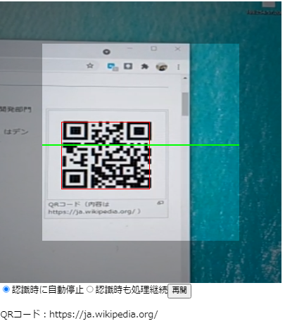

# QRコード認識Reactコンポーネント with Web Worker


* [github-qr-reader-react-webworker](https://github.com/murasuke/qr-reader-react-webworker/)

## はじめに

以前作成した[QRコード認識Reactコンポーネント](https://github.com/murasuke/qr-reader-react)に、上下に移動する「緑色のバー」を追加しました(CSS animation)。バーに機能上の意味はなく、スキャンしている雰囲気を醸し出すだけです。

ところが、バーの動きが**<span style="color: red; ">かくかく</span>**してしまい、きれいなアニメーションになりません。

UIスレッドでQRコード認識(少し時間がかかる)を行うことが原因で、描画処理がブロックされているようです。

解決のため、[Web Worker](https://developer.mozilla.org/ja/docs/Web/API/Web_Workers_API/Using_web_workers)の導入を検討し、試行錯誤の上で動くようになったので、情報としてまとめました。

---

* 結論：[comlink-loader](https://github.com/GoogleChromeLabs/comlink-loader)を利用します。TypeScriptを利用でき、eject不要、Web Workerの処理は通常のメソッド定義で行い、呼び出しは通常の非同期メソッドとして利用できてしまうという優れモノです。

---

※ ↓ 画像なのでわかりづらいですが「緑色のバー」が上下します。




* QRコード認識については[QRコード認識Reactコンポーネント](https://github.com/murasuke/qr-reader-react)をご確認ください。


## create-react-appで作ったアプリケーションとWeb Workerを組み合わせた場合に発生する技術的な課題について

[Create React AppでWeb Workerを使うには](https://blog.makotoishida.com/2018/11/create-react-appweb-worker.html) にまとめられていますが、Web Workerを使うのはかなりしんどいようです。

### 1. publicフォルダにWorkerのJSファイルを配置して読み込む

Web Workerは`.js`ファイルを読み込むため、publicフォルダに`worker.js`ファイルを別途作成して配置しておくか、`worker.ts`を別途tscでビルドしてpublicフォルダに配置するようにする必要がある。

```javascript
const worker = new Worker('worker.js');
worker.postMessage(`hoge`);
```

> 処理内容をTypeScriptで書きたい、別にビルドするのが面倒なので却下

### 2. ejectしてからWebPackの設定に worker-loader または worker-plugin を追加する

> ejectしたくない、WebPackを直接使いたくない却下

### 3. ejectせずに react-app-rewired を使ってWebPackの設定に worker-loader または worker-plugin を追加する。

> WebPackを直接使いたくないので却下・・・
### 4. WorkerのJSファイルをBlobとして読み込んでからWorkerスレッドを生成する。

> わからんでもないが、トリッキー過ぎるので却下・・・

こちらのページで上記1.～4.の議論が行われていますが、結論が良く割りませんでした。
[Is it possible to use load webworkers? #1277](https://github.com/facebook/create-react-app/issues/1277)


## 解決策：`create-react-app`と`Web Worker`で検索したところ、[comlink-loader](https://github.com/GoogleChromeLabs/comlink-loader)という解決策がみつかりました

**Web Workerを意識せず、メソッドの呼び出しとして処理できてしまいます！**


### 使い方

* ./src/worker フォルダに下記3ファイルを作成します

| ファイル名 | 説明 | 
|-----------|------------|
|custom.d.ts|型定義。worker.tsの型に合わせる(戻り値はPromis<>でラップする)|
|index.ts|workerのインラインローダー。説明を読んでもよくわかりません・・・・|
|worker.ts|Web Workerに実行させる処理(function)定義|

```typescript
/* ./worker/custom.d.ts */
declare module 'comlink-loader!*' {
  class WebpackWorker extends Worker {
    constructor();

    // Add any custom functions to this class.
    // Make note that the return type needs to be wrapped in a promise.
    processData(data: ImageData): Promise<QRCode>;
  }

  export = WebpackWorker;
}
```

```typescript
/* ./worker/index.ts */
// eslint-disable-next-line
import Worker from 'comlink-loader!./worker'; // inline loader

export default Worker;
```

```typescript
/* ./worker/worker.ts */
import jsqr, { QRCode } from 'jsqr';

export function processData(data: ImageData): QRCode {
  // Process the data without stalling the UI
  const qr = jsqr(data.data, data.width, data.height);
  if (qr) {
    console.log(qr.data);
    return qr;
  }
  return null;
}
```

* 利用側ソース

Workerを生成して、Promiseを返す非同期メソッドとして呼び出すだけです。

> PostMessage()を使わず、普通のメソッドとしてWeb Workerが呼び出せてしまいます。

```typescript
/* ./QRReader.tsx */
  const worker = new Worker();

  // ～～～ 途 中 略 ～～～

  timerId.current = setInterval(() => {
    context.drawImage(video.current, 0, 0, width, height);
    const imageData = context.getImageData(0, 0, width, height);
    worker.processData(imageData).then(qr => {
    if (qr) {
      console.log(qr.data);
      if (props.showQRFrame) {
        drawRect(qr.location.topLeftCorner, qr.location.bottomRightCorner);
      }
      if (props.onRecognizeCode) props.onRecognizeCode(qr);               
    }
    });
  }, props.timerInterval);
```
